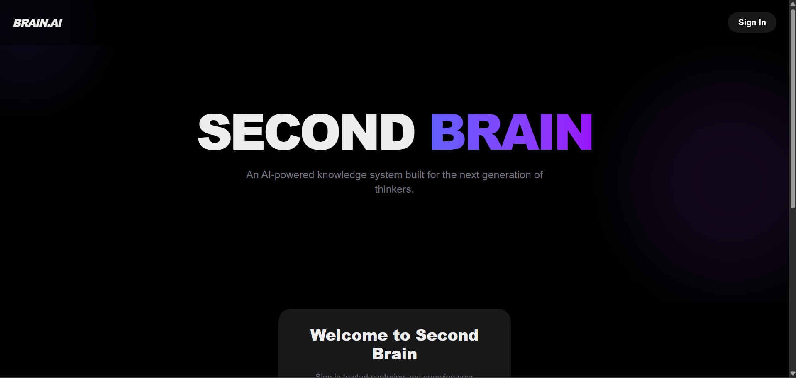
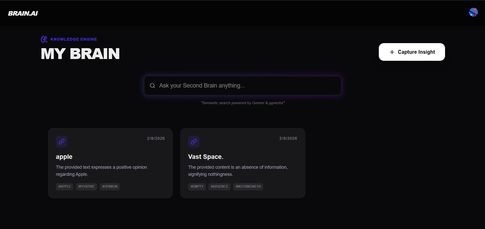
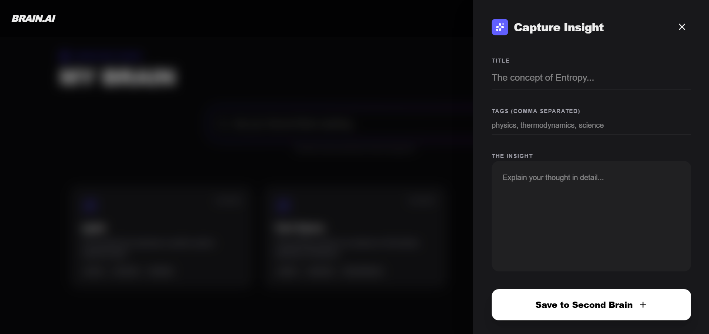
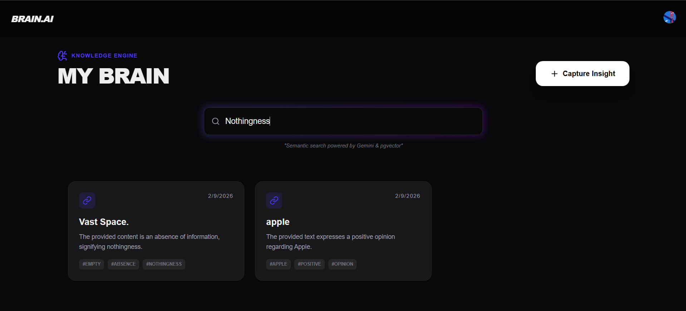

# 🧠 Second Brain — AI-Powered Knowledge Engine

Second Brain is a modern, AI-augmented knowledge system that captures, enriches, and semantically retrieves thoughts using **vector search instead of keywords**.

It is built as a **knowledge infrastructure**, not just a notes app.

---

## 🔗 Live URLs & Demo

- 🌐 **Deployed Application (Vercel)**  
  https://second-brain-tau-blush.vercel.app

- ▶️ **Short Demo Walkthrough (~2 mins)**  
  https://drive.google.com/file/d/1qpZdAeLcDzz7sToz4FhmIv6AYqGmX9ci/view?usp=sharing

- ⚙️ **Backend API (Railway)**  
  https://second-brain-production-7394.up.railway.app

- 📐 **Architecture & Design Docs**  
  https://second-brain-tau-blush.vercel.app/docs

---

## ✨ What is Second Brain?

Second Brain transforms raw thoughts into **structured, searchable knowledge** by combining:

- AI enrichment (summaries, tags)
- Vector embeddings (semantic meaning)
- A clean, motion-first UI
- A decoupled backend API

Instead of asking users to organize knowledge, **the system does it automatically**.

This project was built as part of a full-stack engineering assessment to demonstrate:

- Architectural thinking
- AI-first system design
- Modern frontend engineering
- Backend portability
- Infrastructure mindset

---

## 📸 Screenshots

Add screenshots to `/screenshots` with the following structure:

```
screenshots/
├─ landing.png
├─ dashboard.png
├─ capture.png
└─ search.png
```





=

---

## 🏗️ Architecture Overview

```
Frontend (Next.js + Framer Motion)
        |
        |  JWT (Clerk Auth)
        |
Backend API (FastAPI)
        |
        |  AI Enrichment (Gemini)
        |
Vector DB (Supabase + pgvector)
```

### Why this architecture matters

- Frontend and backend are fully decoupled
- Any UI (web, mobile, CLI) can use the same API
- AI providers can be swapped without redesigning the system
- Knowledge is treated as **infrastructure**, not UI state

---

## 🧩 Core Features

### 📝 Capture with AI Enrichment

When a user creates a note or insight, the backend automatically:

- Generates a concise summary
- Extracts semantic tags
- Creates vector embeddings for future retrieval

**User does less work. AI does more.**

---

### 🔍 Semantic Search (Vector-Based)

- No keyword matching
- Results ranked by **meaning**
- Powered by:
  - Gemini embeddings
  - Supabase + pgvector similarity search

---

### 🎨 Motion-First UX

Framer Motion is used intentionally:

- Staggered dashboard grid
- Slide-over capture modal
- Animated search feedback

---

## 🔐 Authentication

- Secure authentication via **Clerk**
- JWT-based sessions
- User data isolated per account

---

## 🧠 Design Principles

- **Anticipatory AI** — enrich before users ask
- **Minimal Friction** — stay in flow
- **Motion with Intent** — guide attention, reduce cognitive load
- **Clarity over Density** — clean hierarchy

---

## 🔌 Public API

```http
GET /public/brain/{user_id}
```

Exposes a read-only interface to query a user's knowledge base for external integrations.

---

## 🛠️ Tech Stack

### Frontend

- Next.js 14
- TypeScript
- Tailwind CSS
- Framer Motion
- Clerk Auth

### Backend

- FastAPI
- Gemini AI
- Supabase
- pgvector

### Deployment

- Frontend: Vercel
- Backend: Railway

---

## 🚀 Environment Variables

### Frontend (`.env.local`)

```env
NEXT_PUBLIC_API_URL=https://second-brain-production-7394.up.railway.app
NEXT_PUBLIC_CLERK_PUBLISHABLE_KEY=pk_...
```

### Backend (`.env`)

```env
GEMINI_API_KEY=...
SUPABASE_URL=...
SUPABASE_SERVICE_ROLE_KEY=...
```

---

## 🧪 Running Locally

### Backend

```bash
uvicorn main:app --reload
```

### Frontend

```bash
npm install
npm run dev
```

---

## 📂 Repository Structure

```
frontend/
 ├─ app/
 ├─ components/
 ├─ lib/

backend/
 ├─ main.py
 ├─ requirements.txt
 └─ .env
```

---

## ✅ Status

✔ Fully deployed  
✔ Production-ready  
✔ AI-augmented

---

Second Brain demonstrates how AI, UX, and infrastructure can work together to reduce cognitive effort.
